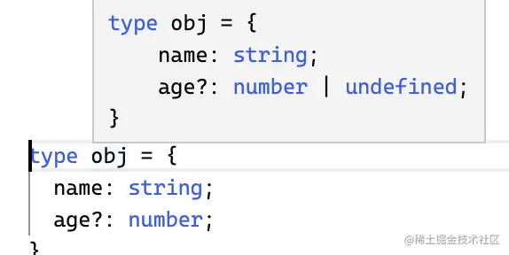
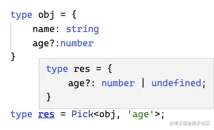
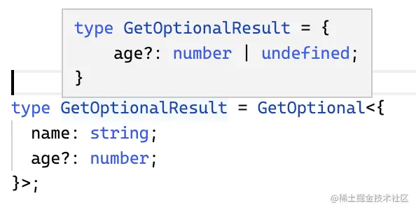
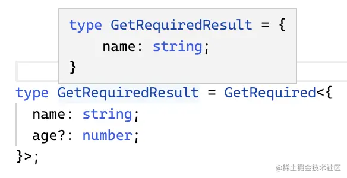
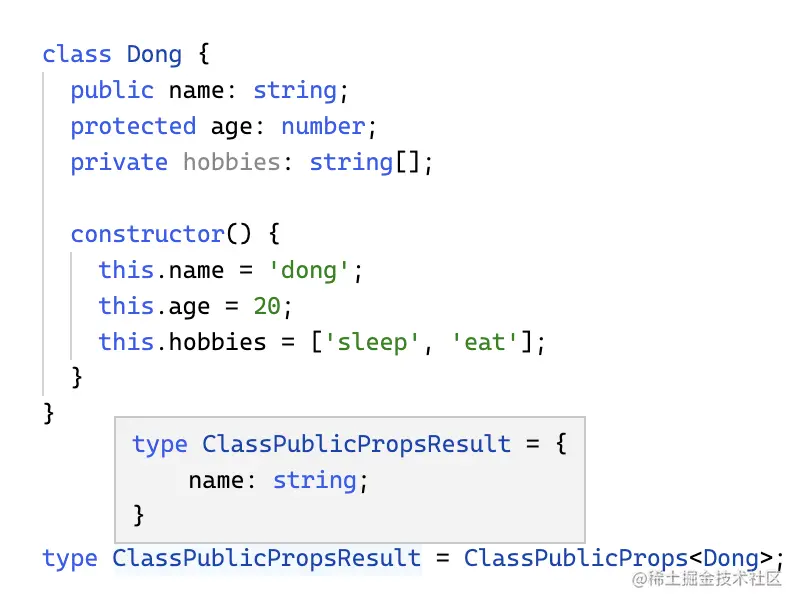
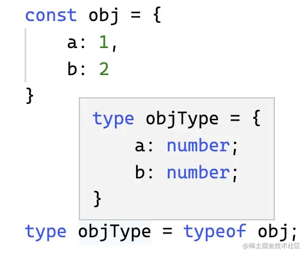
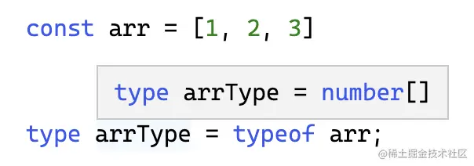
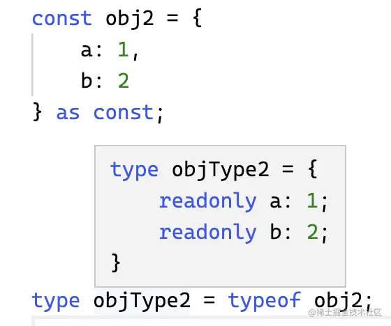

### 
# 10 套路六：特殊特性要记清
我们会了提取、构造、递归、数组长度的计数、联合类型的分散之后，各种类型体操都能写了 ，只不过有些类型的特性比较特殊，要专门记一下。

这是类型体操的第六个套路：特殊特性要记清。

## 特殊类型的特性
TypeScript 类型系统中有些类型比较特殊，比如 any、never、联合类型，比如 class 有 public、protected、private 的属性，比如索引类型有具体的索引和可索引签名，索引还有可选和非可选。。。

如果给我们一种类型让我们判断是什么类型，应该怎么做呢？

**类型的判断要根据它的特性来，比如判断联合类型就要根据它的 distributive 的特性。**

我们分别看一下这些特性：

## IsAny
如何判断一个类型是 any 类型呢？要根据它的特性来：

**any 类型与任何类型的交叉都是 any，也就是 1 & any 结果是 any。**

所以，可以这样写：

```Plain Text
type IsAny<T> = 'dong' extends ('guang' & T) ? true : false

```
这里的 'dong' 和 'guang' 可以换成任意两个不同的类型。

当传入 any 时：


当传入其他类型时：


[试一下](https://link.juejin.cn/?target=https%3A%2F%2Fwww.typescriptlang.org%2Fplay%3F%23code%2FC4TwDgpgBAkgzgQQHYgDwBUB8UC8UDkAJgPZIDm%2BUEAHsBEoXFABT5kCuAhuZQGRToAlFAD8UYACd20AFxQAZpwA2cCACg1oSLEQoAShDjslwXDuRpuITAG4NW6PAsGjJgExmnKVGy49bGkA "https://www.typescriptlang.org/play?#code/C4TwDgpgBAkgzgQQHYgDwBUB8UC8UDkAJgPZIDm+UEAHsBEoXFABT5kCuAhuZQGRToAlFAD8UYACd20AFxQAZpwA2cCACg1oSLEQoAShDjslwXDuRpuITAG4NW6PAsGjJgExmnKVGy49bGkA")

## IsEqual
之前我们实现 IsEqual 是这样写的：

```Plain Text
type IsEqual<A, B> = (A extends B ? true : false) & (B extends A ? true : false);

```
问题也出在 any 的判断上：


因为 any 可以是任何类型，任何类型也都是 any，所以当这样写判断不出 any 类型来。

所以，我们会这样写：

```Plain Text
type IsEqual2<A, B> = (<T>() => T extends A ? 1 : 2) extends (<T>() => T extends B ? 1 : 2)
    ? true : false;

```
这样就能正常判断了：


这是因为 TS 对这种形式的类型做了特殊处理，是一种 hack 的写法，它的解释要从 TypeScript 源码找答案了，我放到了[原理篇](https://juejin.cn/book/7047524421182947366/section/7064835788197855272 "https://juejin.cn/book/7047524421182947366/section/7064835788197855272")。感兴趣可以提前看一下。

[试一下](https://link.juejin.cn/?target=https%3A%2F%2Fwww.typescriptlang.org%2Fplay%3F%23code%2FC4TwDgpgBAkgzgUQI4FcCGAbAPAQQDRQBCAfFALxQAUOUEAHsBAHYAmcRUA-FMAE4rQAXFABmmOBACUUAGRVCtBszZQa3PgKjCxGCZIDcAKEOhIsRKkwAlCOwrxk6bAHI0zgmiYhiRk%2BGgOlhgATLgEJORUWAAqxJTSZKTRioys7GpQAIxaUMHS9KkqlDFxCUkpyuwK3NnCeYZQjVw8-EKi4hC%2BpgEWTsE2duaOmKGu7lCe3kZAA "https://www.typescriptlang.org/play?#code/C4TwDgpgBAkgzgUQI4FcCGAbAPAQQDRQBCAfFALxQAUOUEAHsBAHYAmcRUA-FMAE4rQAXFABmmOBACUUAGRVCtBszZQa3PgKjCxGCZIDcAKEOhIsRKkwAlCOwrxk6bAHI0zgmiYhiRk+GgOlhgATLgEJORUWAAqxJTSZKTRioys7GpQAIxaUMHS9KkqlDFxCUkpyuwK3NnCeYZQjVw8-EKi4hC+pgEWTsE2duaOmKGu7lCe3kZAA")

## IsUnion
还记得怎么判断 union 类型么？要根据它遇到条件类型时会分散成单个传入做计算的特性：

```Plain Text
type IsUnion<A, B = A> =
    A extends A
        ? [B] extends [A]
            ? false
            : true
        : never

```
这里的 A 是单个类型，B 是整个联合类型，所以根据 \[B\] extends \[A\] 是否成立来判断是否是联合类型。（详见上节）

当传入联合类型时：


当传入单个类型时：


[试一下](https://link.juejin.cn/?target=https%3A%2F%2Fwww.typescriptlang.org%2Fplay%3F%23code%2FC4TwDgpgBAkgzgVQHYEsD2SA8BBANFAISgF4psA%2BEgKClrKggA9gIkATOMmungfigDaBALoNmrDoOzDuPOVH4AzAIYAbOBFny6ALijAATgFdN2qHqQQAbhANV7oSLESoMAJQidS8ZOiwBGKAAfKAAmcgBuB3BoH1ckDzhQkmdfDEx-SPsqIA "https://www.typescriptlang.org/play?#code/C4TwDgpgBAkgzgVQHYEsD2SA8BBANFAISgF4psA+EgKClrKggA9gIkATOMmungfigDaBALoNmrDoOzDuPOVH4AzAIYAbOBFny6ALijAATgFdN2qHqQQAbhANV7oSLESoMAJQidS8ZOiwBGKAAfKAAmcgBuB3BoH1ckDzhQkmdfDEx-SPsqIA")

## IsNever
never 在条件类型中也比较特殊，如果条件类型左边是类型参数，并且传入的是 never，那么直接返回 never：

```Plain Text
type TestNever<T> = T extends number ? 1 : 2;

```
当 T 为 never 时：


所以，要判断 never 类型，就不能直接 T extends number，可以这样写：

```Plain Text
type IsNever<T> = [T] extends [never] ? true : false

```
这样就能正常判断 never 类型了：


[试一下](https://link.juejin.cn/?target=https%3A%2F%2Fwww.typescriptlang.org%2Fplay%3F%23code%2FC4TwDgpgBAKhDOwByEBuEBOAeGA%2BKAvLFBAB7AQB2AJvFJQK4C2ARplAPxQCMUAXFABMAbgBQo0JFgJkaTACUEhaYhTpslORlxiJ4aAEl4azDnxEA2jAC6JclVpQLm9ba7AMDaAIBmAQwAbeAhxSUNjLUU6IiMTDS0dcSA "https://www.typescriptlang.org/play?#code/C4TwDgpgBAKhDOwByEBuEBOAeGA+KAvLFBAB7AQB2AJvFJQK4C2ARplAPxQCMUAXFABMAbgBQo0JFgJkaTACUEhaYhTpslORlxiJ4aAEl4azDnxEA2jAC6JclVpQLm9ba7AMDaAIBmAQwAbeAhxSUNjLUU6IiMTDS0dcSA")

除此以外，any 在条件类型中也比较特殊，如果类型参数为 any，会直接返回 trueType 和 falseType 的合并：

```Plain Text
type TestAny<T> = T extends number ? 1 : 2;

```


[试一下](https://link.juejin.cn/?target=https%3A%2F%2Fwww.typescriptlang.org%2Fplay%3F%23code%2FC4TwDgpgBAKhDOwCCA7EAeGA%2BKBeWUEAHsBCgCbxQoCuAtgEYQBOUA-FAIxQBcUATAG4AUMNCRYCZGgBKCPJMSoMAQzRYRorcKA "https://www.typescriptlang.org/play?#code/C4TwDgpgBAKhDOwCCA7EAeGA+KBeWUEAHsBCgCbxQoCuAtgEYQBOUA-FAIxQBcUATAG4AUMNCRYCZGgBKCPJMSoMAQzRYRorcKA")

联合类型、never、any 在作为条件类型的类型参数时的这些特殊情况，也会在后面的原理篇来解释原因。

## IsTuple
元组类型怎么判断呢？它和数组有什么区别呢？

**元组类型的 length 是数字字面量，而数组的 length 是 number。**


如图，元组和数组的 length 属性值是有区别的。

那我们就可以根据这两个特性来判断元组类型：

```Plain Text
type IsTuple<T> = 
    T extends [...params: infer Eles] 
        ? NotEqual<Eles['length'], number> 
        : false

```
类型参数 T 是要判断的类型。

首先判断 T 是否是数组类型，如果不是则返回 false。如果是继续判断 length 属性是否是 number。

如果是数组并且 length 不是 number 类型，那就代表 T 是元组。

NotEqual 的实现是这样的：

```Plain Text
type NotEqual<A, B> = 
    (<T>() => T extends A ? 1 : 2) extends (<T>() => T extends B ? 1 : 2)
    ? false : true;

```
A 是 B 类型，并且 B 也是 A 类型，那么就是同一个类型，返回 false，否则返回 true。

这样就可以判断出元组类型：

当传入元组时：


当传入数组时：


[试一下](https://link.juejin.cn/?target=https%3A%2F%2Fwww.typescriptlang.org%2Fplay%3F%23code%2FC4TwDgpgBANhB2UC8UDaBGANAJkwZgF1UByOeAc2AAtiCBuAKAdElgW2SngFcBbAIwgAnVEVIJKNAkxbQAkgGcAKtzBwAPEoB8nBlH1QlUCAA9gCACYK0AOjtgAhkIe8FALigBLeADNhUAFE4BQIoPQMIgH4oADkAe2AAgEduBxh1IIgFEjJJWkwuPkEhHXCI-Q8fNIUIRmZwaHjElLT1AEECgCEdFDKoAApNLX6ASmQdI1NzeCsoNqho9CgPbDGpy2tB7VHxw2MzDahOhagllZG%2B6KqYGuWoYCFuWqZ61kUVNQgAJSzuGGBOO9VBoMAVcFBCFo6rIoEDPj8FH9gBwUHCNDwBMJRFCgA "https://www.typescriptlang.org/play?#code/C4TwDgpgBANhB2UC8UDaBGANAJkwZgF1UByOeAc2AAtiCBuAKAdElgW2SngFcBbAIwgAnVEVIJKNAkxbQAkgGcAKtzBwAPEoB8nBlH1QlUCAA9gCACYK0AOjtgAhkIe8FALigBLeADNhUAFE4BQIoPQMIgH4oADkAe2AAgEduBxh1IIgFEjJJWkwuPkEhHXCI-Q8fNIUIRmZwaHjElLT1AEECgCEdFDKoAApNLX6ASmQdI1NzeCsoNqho9CgPbDGpy2tB7VHxw2MzDahOhagllZG+6KqYGuWoYCFuWqZ61kUVNQgAJSzuGGBOO9VBoMAVcFBCFo6rIoEDPj8FH9gBwUHCNDwBMJRFCgA")

## UnionToIntersection
类型之间是有父子关系的，更具体的那个是子类型，比如 A 和 B 的交叉类型 A & B 就是联合类型 A | B 的子类型，因为更具体。

如果允许父类型赋值给子类型，就叫做**逆变**。

如果允许子类型赋值给父类型，就叫做**协变**。

（关于逆变、协变等概念的详细解释可以看原理篇）

在 TypeScript 中有函数参数是有逆变的性质的，也就是如果参数可能是多个类型，参数类型会变成它们的交叉类型。

所以联合转交叉可以这样实现 ：

```Plain Text
type UnionToIntersection<U> = 
    (U extends U ? (x: U) => unknown : never) extends (x: infer R) => unknown
        ? R
        : never

```
类型参数 U 是要转换的联合类型。

U extends U 是为了触发联合类型的 distributive 的性质，让每个类型单独传入做计算，最后合并。

利用 U 做为参数构造个函数，通过模式匹配取参数的类型。

结果就是交叉类型：


[试一下](https://link.juejin.cn/?target=https%3A%2F%2Fwww.typescriptlang.org%2Fplay%3F%23code%2FFAFwngDgpgBAqgOwJYHsEBUUEkEigJwGcoBjEVBAHjgD4YBeGYGFmACjhigA88EATQvBgB%2BdtwBc8AJQM6AVwQBrBCgDuCGFIRQAbgVk8%2Bg8VKQIAZgRgAlWfQXLVG5qzdibrty216CAbmBQSFhECkwcPCJScjQbKEJ5ABsQBnhkNAjcAmIyCkoAbxgAc3kAQwRiqQBGGABfGAAfGCL%2BNCqYACZ6mn8gA "https://www.typescriptlang.org/play?#code/FAFwngDgpgBAqgOwJYHsEBUUEkEigJwGcoBjEVBAHjgD4YBeGYGFmACjhigA88EATQvBgB+dtwBc8AJQM6AVwQBrBCgDuCGFIRQAbgVk8+g8VKQIAZgRgAlWfQXLVG5qzdibrty216CAbmBQSFhECkwcPCJScjQbKEJ5ABsQBnhkNAjcAmIyCkoAbxgAc3kAQwRiqQBGGABfGAAfGCL+NCqYACZ6mn8gA")

函数参数的逆变性质一般就联合类型转交叉类型会用，记住就行。

## GetOptional
如何提取索引类型中的可选索引呢？

这也要利用可选索引的特性：**可选索引的值为 undefined 和值类型的联合类型**。



过滤可选索引，就要构造一个新的索引类型，过程中做过滤：

```Plain Text
type GetOptional<Obj extends  Record<string, any>> = {
    [
        Key in keyof Obj 
            as {} extends Pick<Obj, Key> ? Key : never
    ] : Obj[Key];
}

```
类型参数 Obj 为待处理的索引类型，类型约束为索引为 string、值为任意类型的索引类型 Record<string, any>。

用映射类型的语法重新构造索引类型，索引是之前的索引也就是 Key in keyof Obj，但要做一些过滤，也就是 as 之后的部分。

过滤的方式就是单独取出该索引之后，判断空对象是否是其子类型。

这里的 Pick 是 ts 提供的内置高级类型，就是取出某个 Key 构造新的索引类型：

```Plain Text
type Pick<T, K extends keyof T> = { [P in K]: T[P]; }

```
比如单独取出 age 构造的新的索引类型是这样的：



可选的意思是这个索引可能没有，没有的时候，那 Pick<Obj, Key> 就是空的，所以 {} extends Pick<Obj, Key> 就能过滤出可选索引。

值的类型依然是之前的，也就是 Obj\[Key\]。

这样，就能过滤出所有可选索引，构造成新的索引类型：



注意，可选不是值可能是 undefined 的意思，比如这样：

```Plain Text
type Obj = {
    a: 'aaa' | undefined
};

```
这个 a 的索引是可选的么？

明显不是，加上 ? 才是。

```Plain Text
type Obj = {
    a?: 'aaa' | undefined
};

```
可选的意思是指有没有这个索引，而不是索引值是不是可能 undefined。

[试一下](https://link.juejin.cn/?target=https%3A%2F%2Fwww.typescriptlang.org%2Fplay%3F%23code%2FC4TwDgpgBA4hwHkzAJYHsB2BDANgHgQCMArKCAD2AgwBMBnKKAJQgGM0AnGvO4DlDAHMANFCwYQAPklQAvFADeAKEaMA2itVaA0hBBQBUANZ60AMyhFSmrbbEMFAXzKVq9KAAUUrIwRKjdKSgAfihAqAAuKAwIADcIDhsoAF1IyxI1QOSAbiVHJQLQSFh4JFRMXBY6AFccYDkSxGR0bHxlRmwAWwgo3n4hXMYsQQhgqIxqzsIE3MdJXKA "https://www.typescriptlang.org/play?#code/C4TwDgpgBA4hwHkzAJYHsB2BDANgHgQCMArKCAD2AgwBMBnKKAJQgGM0AnGvO4DlDAHMANFCwYQAPklQAvFADeAKEaMA2itVaA0hBBQBUANZ60AMyhFSmrbbEMFAXzKVq9KAAUUrIwRKjdKSgAfihAqAAuKAwIADcIDhsoAF1IyxI1QOSAbiVHJQLQSFh4JFRMXBY6AFccYDkSxGR0bHxlRmwAWwgo3n4hXMYsQQhgqIxqzsIE3MdJXKA")

## GetRequired
实现了 GetOptional，那反过来就是 GetRequired，也就是过滤所有非可选的索引构造成新的索引类型：

```Plain Text
type isRequired<Key extends keyof Obj, Obj> = 
    {} extends Pick<Obj, Key> ? never : Key;

type GetRequired<Obj extends Record<string, any>> = { 
    [Key in keyof Obj as isRequired<Key, Obj>]: Obj[Key] 
}

```
这样就过滤出了非可选类型：



[试一下](https://link.juejin.cn/?target=https%3A%2F%2Fwww.typescriptlang.org%2Fplay%3F%23code%2FC4TwDgpgBAlgzgJQgRwK4wE4QCYB4DSEIUEAHsBAHbZxQDWRA9gGZQDyARgFYA073APigBeKACgokqAG8AviXJUaUAAowAxnVydeUQiCEB%2BKJQgA3CBigAuPUQDcYsaEhQA4hGBI0mHNu4KFNS0SOqMGHhwwBgwlADmfACGlAZCotLiUlAA2vqwlPRMrDpQibTw3uhYePp8OgIAurY6uUQN4rJOLtAeXihVOEhwqAA2wCLunpW%2BeNISJokAthC2UTHxjpKJcRCGtpSoixyWjrICjkA "https://www.typescriptlang.org/play?#code/C4TwDgpgBAlgzgJQgRwK4wE4QCYB4DSEIUEAHsBAHbZxQDWRA9gGZQDyARgFYA073APigBeKACgokqAG8AviXJUaUAAowAxnVydeUQiCEB+KJQgA3CBigAuPUQDcYsaEhQA4hGBI0mHNu4KFNS0SOqMGHhwwBgwlADmfACGlAZCotLiUlAA2vqwlPRMrDpQibTw3uhYePp8OgIAurY6uUQN4rJOLtAeXihVOEhwqAA2wCLunpW+eNISJokAthC2UTHxjpKJcRCGtpSoixyWjrICjkA")

## RemoveIndexSignature
索引类型可能有索引，也可能有可索引签名。

比如：

```Plain Text
type Dong = {
  [key: string]: any;
  sleep(): void;
}

```
这里的 sleep 是具体的索引，\[key: string\]: any 就是可索引签名，代表可以添加任意个 string 类型的索引。

如果想删除索引类型中的可索引签名呢？

同样根据它的性质，**索引签名不能构造成字符串字面量类型，因为它没有名字，而其他索引可以。**

所以，就可以这样过滤：

```Plain Text
type RemoveIndexSignature<Obj extends Record<string, any>> = {
  [
      Key in keyof Obj 
          as Key extends `${infer Str}`? Str : never
  ]: Obj[Key]
}

```
类型参数 Obj 是待处理的索引类型，约束为 Record<string, any>。

通过映射类型语法构造新的索引类型，索引是之前的索引 Key in keyof Obj，但要做一些过滤，也就是 as 之后的部分。

如果索引是字符串字面量类型，那么就保留，否则返回 never，代表过滤掉。

值保持不变，也就是 Obj\[Key\]。

这样就可以过滤掉可索引签名：


[试一下](https://link.juejin.cn/?target=https%3A%2F%2Fwww.typescriptlang.org%2Fplay%3F%23code%2FC4TwDgpgBAShC2B7AbhAkgOwCYQB4GUBLAcwwENgBXAJwgB4B5AIwCso9gJsBnWCAY0TUsdbsGqEMxADRQyGEAD5FUALxQA3gCgoUANo7dRgNIQQUSVADWZxADMozNoaOu5vU%2BY5csvAAYAJBqSdhDUUPjiAL5%2BAPwR4lAAXFAYEKjUhgC6KU56nllaUVpaoJB8SKiYOAQk5FS0cNyUADbAahUo6Nh4RKQUNPTauno2ICliElI5cgoA3IbcLRAQYAAUAJQpyIiEWAtRinNAA "https://www.typescriptlang.org/play?#code/C4TwDgpgBAShC2B7AbhAkgOwCYQB4GUBLAcwwENgBXAJwgB4B5AIwCso9gJsBnWCAY0TUsdbsGqEMxADRQyGEAD5FUALxQA3gCgoUANo7dRgNIQQUSVADWZxADMozNoaOu5vU+Y5csvAAYAJBqSdhDUUPjiAL5+APwR4lAAXFAYEKjUhgC6KU56nllaUVpaoJB8SKiYOAQk5FS0cNyUADbAahUo6Nh4RKQUNPTauno2ICliElI5cgoA3IbcLRAQYAAUAJQpyIiEWAtRinNAA")

## ClassPublicProps
如何过滤出 class 的 public 的属性呢？

也同样是根据它的特性：**keyof 只能拿到 class 的 public 索引，private 和 protected 的索引会被忽略**。

比如这样一个 class：

```Plain Text
class Dong {
  public name: string;
  protected age: number;
  private hobbies: string[];

  constructor() {
    this.name = 'dong';
    this.age = 20;
    this.hobbies = ['sleep', 'eat'];
  }
}

```
keyof 拿到的只有 name：


所以，我们就可以根据这个特性实现 public 索引的过滤：

```Plain Text
type ClassPublicProps<Obj extends Record<string, any>> = {
    [Key in keyof Obj]: Obj[Key]    
}

```
类型参数 Obj 为带处理的索引类型，类和对象都是索引类型，约束为 Record<string, any>。

构造新的索引类型，索引是 keyof Obj 过滤出的索引，也就是 public 的索引。

值保持不变，依然是 Obj\[Key\]。

这样就能过滤出 public 的属性：



[试一下](https://link.juejin.cn/?target=https%3A%2F%2Fwww.typescriptlang.org%2Fplay%3F%23code%2FMYGwhgzhAEAiD2A7A5tA3gKGtADgVwCMQBLYaRMAWwFMAuaCAFwCdiUBuLXZ%2BR64PgBNoYZHXJ5KBas07YcrAG5g%2B0ABbwCBYtQj0mrFAG0Aupy7AkBvAPjMAFAEp0XbIzXEIAOgo1oAXmgAckEkZCC5bGh3Ty9RagDoACYABki3D28NLR0YQKMgiBBqahwggBpg6hUgsy4AXwxGjEYATxwEgGFwKAAFQhJgXp4cCAAlXTwQRkTuyAh%2BolJh%2BFGAHgQUAD5zFvaunoWB5ZGINYB5AgAraGoADz5EQRgJy2ZBNYM2ZEqwRFatltEpgotAjABpaitaBsaAAayh8AAZtBLlcTPQ0RCoSZQU0MASgA "https://www.typescriptlang.org/play?#code/MYGwhgzhAEAiD2A7A5tA3gKGtADgVwCMQBLYaRMAWwFMAuaCAFwCdiUBuLXZ+R64PgBNoYZHXJ5KBas07YcrAG5g+0ABbwCBYtQj0mrFAG0Aupy7AkBvAPjMAFAEp0XbIzXEIAOgo1oAXmgAckEkZCC5bGh3Ty9RagDoACYABki3D28NLR0YQKMgiBBqahwggBpg6hUgsy4AXwxGjEYATxwEgGFwKAAFQhJgXp4cCAAlXTwQRkTuyAh+olJh+FGAHgQUAD5zFvaunoWB5ZGINYB5AgAraGoADz5EQRgJy2ZBNYM2ZEqwRFatltEpgotAjABpaitaBsaAAayh8AAZtBLlcTPQ0RCoSZQU0MASgA")

## as const
TypeScript 默认推导出来的类型并不是字面量类型。

比如对象：



数组：



但是类型编程很多时候是需要推导出字面量类型的，这时候就需要用 as const：




但是加上 as const 之后推导出来的类型是带有 readonly 修饰的，所以再通过模式匹配提取类型的时候也要加上 readonly 的修饰才行。

> const 是常量的意思，也就是说这个变量首先是一个字面量值，而且还不可修改，有字面量和 readonly 两重含义。所以加上 as const 会推导出 readonly 的字面量类型。

比如反转那个三个元素的元组类型，不加上 readonly 再匹配是匹配不出来的：


加上 readonly 之后就可以正常匹配了：


这点在类型编程的实际应用中经常遇到，要注意一下。 [试一下](https://link.juejin.cn/?target=https%3A%2F%2Fwww.typescriptlang.org%2Fplay%3Fts%3D4.5.0-beta%23code%2FMYewdgzgLgBCBGArGBeGBvAUDHMCGAXDAIwA02u8RATJgL6aZQCeADgKZxIAqbnaLDiABmXRAG5GoSLDwAnOahgBtMjGqkYAZgC6jQZ3lzeHJQZH4FkzNOhjqSrLnxEyFHFXX18EGLajWTHxiJuwOAnwWCIjU1v6WcuEqahraOj5%2B4NCBBgmhSeaiRrGMQaYASuwAbuxyEOwAggoAPE1yAHxKbTDsAB5Q7GAAJr5y7HhD4AA2zCoAlmDCtTANmgtLigBCa4vLAMLpAPwqe5rbK%2BlEYNW1OcGVNXWNCpW%2BaA%2B19W3NRvnt4kA "https://www.typescriptlang.org/play?ts=4.5.0-beta#code/MYewdgzgLgBCBGArGBeGBvAUDHMCGAXDAIwA02u8RATJgL6aZQCeADgKZxIAqbnaLDiABmXRAG5GoSLDwAnOahgBtMjGqkYAZgC6jQZ3lzeHJQZH4FkzNOhjqSrLnxEyFHFXX18EGLajWTHxiJuwOAnwWCIjU1v6WcuEqahraOj5+4NCBBgmhSeaiRrGMQaYASuwAbuxyEOwAggoAPE1yAHxKbTDsAB5Q7GAAJr5y7HhD4AA2zCoAlmDCtTANmgtLigBCa4vLAMLpAPwqe5rbK+lEYNW1OcGVNXWNCpW+aA+19W3NRvnt4kA")

## 总结
学完前面 5 个套路，我们已经能够实现各种类型编程逻辑了，但一些类型的特性还是要记一下。在判断或者过滤类型的时候会用到：

* any 类型与任何类型的交叉都是 any，也就是 1 & any 结果是 any，可以用这个特性判断 any 类型。
* 联合类型作为类型参数出现在条件类型左侧时，会分散成单个类型传入，最后合并。
* never 作为类型参数出现在条件类型左侧时，会直接返回 never。
* any 作为类型参数出现在条件类型左侧时，会直接返回 trueType 和 falseType 的联合类型。
* 元组类型也是数组类型，但 length 是数字字面量，而数组的 length 是 number。可以用来判断元组类型。
* 函数参数处会发生逆变，可以用来实现联合类型转交叉类型。
* 可选索引的索引可能没有，那 Pick 出来的就可能是 {}，可以用来过滤可选索引，反过来也可以过滤非可选索引。
* 索引类型的索引为字符串字面量类型，而可索引签名不是，可以用这个特性过滤掉可索引签名。
* keyof 只能拿到 class 的 public 的索引，可以用来过滤出 public 的属性。
* 默认推导出来的不是字面量类型，加上 as const 可以推导出字面量类型，但带有 readonly 修饰，这样模式匹配的时候也得加上 readonly 才行。

这些类型的特性要专门记一下，其实过两遍就记住了。

熟悉了这些特殊的特性，配合提取、构造、递归、数组长度计数、联合分散这五种套路，就可以实现各种类型体操。

[本文案例的合并](https://link.juejin.cn/?target=https%3A%2F%2Fwww.typescriptlang.org%2Fplay%3F%23code%2FPTAEEkGcEEDsE8BQAXeAHAphGCA8AVAPlAF5QByAEwHtYBzc0DAD2Q1kslAApy6BXAIb1GAMlD4AlKAD8oZACd%2BWAFygAZoIA2kDIhTosUOPABKGSPy3JS2E7mHxCAbn2pMdhOcvWATLeM8PiERF30QbABRAEchLQMPKBi43GgAGlAAIWIybmgmVnZOLNlQAEZQNV9pcW5MgrYOLny5CqrJVwSjSGTtbwCe2O1cckFyDMcwrqihrV9UjOzbbgJCbmkSYnwGoubSttBqnaaeVfXSLePi%2BtbKw8lEUCfSxWU7zR0MTvdu3rn%2BshJWbzUbjUCTToRKAAVVgAEtaNMYfDaAsSmRoDlHs98ixGsVoNjns85ABtTIAXSuXFJ0ApROJjLkH10DMZzzUrz07KealgGAAbhgFG5DNhYQjYN4rDZAZAJajyNBGAAfCiZchhH7ilFSiwy-xyhWwEbKqYgKAAOUFwqRkGtQoUq1spPwVLxu1ApP5jqpci5720rLtDuF0usA1DTp9wq1YqtNoU4eQhuwUYcCCm2vwFmQ9iItm2HpOsH4AFsAEbC-Z3XzfMU5yB5rwWQu5%2BwQ8LAKD4fhoLR6bUD2AusppXxpADMFNJ5GHdGQAAtyBT6x5h6nS5XhaSZ3P2Avl-S7b3%2BxhnWQGUXCidSQA6B9oQQKQRlyBqOGwdTVyIDyBUtkSVAS1qGQP5cF-CxZ3nJcVwyLcqwUYhAN5DQgy%2BUUPBAsDZjRJZL2JFYiHOTYJGpUAWnKWtpGLYoiLWDZLlorgbio9oUNKFlVHkJQMMw7pTwHZMBkE89STHQ4MmnLN40gUTk1THs%2BwHXAEJ3ClzWAY18GocBYDYBRdAAY2QSV%2BNAbTdP04VjNM1FoRyUAGW4aFyNcuRuGYNRoUY0B%2BFgABrWBqAAdxHPlExom86K80BP2-BRQFMXz-KC0LYA4uRTA4iLHTXLBLL0gzbMlYSyEK6zDIwEzJVwABvUABGEOg1AqABfUA1Qamh6CqUA2s0gBxDBkAAeTQOzYG0aZhrGibJWGUaKwAK3IpLquoBRKFwJsFE-OgJkzRy6oZUkOIAaQweA4pHAKruodRQCW1aOOJQQuDqjrmNAAAFOEjIC3BnoyS6nFKUG7hjEViSpNRntJUHV0QNr9Bmkbxsmvp9QjMhZoxhatHq7EprLDA1F2-bXCeQQ6AwGQ%2BXLRDXAGyFgFm8xYjhBQMEoaY4UgDn%2BC5nncAh767vgB6npWjJnschlPvIv6AaBmXQFB4g5Chu5Qfy0B2YwTnue257yPMIzNu2in6EOpxjqc4kEaum7QAlqXTfeuKBcNoXjdFq7ZZWwgKThlanfgACUbR5BBeFygyv1kbY79k6nhJsnQGtugqfBWn6dANSFGZzTzDLaghT0ygWAAZThOgpuQfhuemUvy4wSua7rhum-PU3vvNy2dsUfbbcIY7sTO9kIc-V37se03XvBLgxeirgAAMABI6vi6tq8UNq17kPfEty20nhD6XlvD%2Bko%2B1VuK44Tv68ERvuYT%2B-28f5ha%2Bf1-z1Tr0EtybD3oBfRwOdIADgwGgdYagBTUDhJQYurgQAAGEtDvUgD9fgFYtD-R%2BgoagaBICICMhgyAXAAAitA6CgAAWgHBeCjIF1fBnLOOc0CELYCZHmucM6Fw4XtAUL8sCLmoBWCscILDAL2vQXcnQngW1gLtfgJlNrnAAU8Jc-M7zp1sFQGh5Ac5aMXDommWAyC%2BAAAzGPkKYyAd4xESKkVwMgs5IEYGgWCcgGAX4rhzijW%2BYp0GYOwbg-BhDiEJxCRQsJTCCFEMgLgah9ApjTBiVgxhETEmq1Wv3DaW0h6yIOuCI6thNFemnrdOel8L7w0RsSZGXYl6gCUU2UhtAmygHEatMgFTBCtTSAyCsVQmnTB6fgMUZAfhSx6Z0NpNhnyJTcRJCcoBpzmSWZMjw0zDBSyWfMzpNgempn6YM4ZoyOqewWZ0cZK1tkYFTDMx6JzDnKMWQoBQqZxIZDWdOFpNzUbai2YYJ5ezHpLLrECsU5hHS6GgJ81InzHIIsSt9bmggepaGuqSHeiV0g3QSlkDIeLQCoL9F6VBiwMh0khomW5d9Ezws%2BQCdacKMCoocJ8h5vgXBAA "https://www.typescriptlang.org/play?#code/PTAEEkGcEEDsE8BQAXeAHAphGCA8AVAPlAF5QByAEwHtYBzc0DAD2Q1kslAApy6BXAIb1GAMlD4AlKAD8oZACd+WAFygAZoIA2kDIhTosUOPABKGSPy3JS2E7mHxCAbn2pMdhOcvWATLeM8PiERF30QbABRAEchLQMPKBi43GgAGlAAIWIybmgmVnZOLNlQAEZQNV9pcW5MgrYOLny5CqrJVwSjSGTtbwCe2O1cckFyDMcwrqihrV9UjOzbbgJCbmkSYnwGoubSttBqnaaeVfXSLePi+tbKw8lEUCfSxWU7zR0MTvdu3rn+shJWbzUbjUCTToRKAAVVgAEtaNMYfDaAsSmRoDlHs98ixGsVoNjns85ABtTIAXSuXFJ0ApROJjLkH10DMZzzUrz07KealgGAAbhgFG5DNhYQjYN4rDZAZAJajyNBGAAfCiZchhH7ilFSiwy-xyhWwEbKqYgKAAOUFwqRkGtQoUq1spPwVLxu1ApP5jqpci5720rLtDuF0usA1DTp9wq1YqtNoU4eQhuwUYcCCm2vwFmQ9iItm2HpOsH4AFsAEbC-Z3XzfMU5yB5rwWQu5+wQ8LAKD4fhoLR6bUD2AusppXxpADMFNJ5GHdGQAAtyBT6x5h6nS5XhaSZ3P2Avl-S7b3+xhnWQGUXCidSQA6B9oQQKQRlyBqOGwdTVyIDyBUtkSVAS1qGQP5cF-CxZ3nJcVwyLcqwUYhAN5DQgy+UUPBAsDZjRJZL2JFYiHOTYJGpUAWnKWtpGLYoiLWDZLlorgbio9oUNKFlVHkJQMMw7pTwHZMBkE89STHQ4MmnLN40gUTk1THs+wHXAEJ3ClzWAY18GocBYDYBRdAAY2QSV+NAbTdP04VjNM1FoRyUAGW4aFyNcuRuGYNRoUY0B+FgABrWBqAAdxHPlExom86K80BP2-BRQFMXz-KC0LYA4uRTA4iLHTXLBLL0gzbMlYSyEK6zDIwEzJVwABvUABGEOg1AqABfUA1Qamh6CqUA2s0gBxDBkAAeTQOzYG0aZhrGibJWGUaKwAK3IpLquoBRKFwJsFE-OgJkzRy6oZUkOIAaQweA4pHAKruodRQCW1aOOJQQuDqjrmNAAAFOEjIC3BnoyS6nFKUG7hjEViSpNRntJUHV0QNr9Bmkbxsmvp9QjMhZoxhatHq7EprLDA1F2-bXCeQQ6AwGQ+XLRDXAGyFgFm8xYjhBQMEoaY4UgDn+C5nncAh767vgB6npWjJnschlPvIv6AaBmXQFB4g5Chu5Qfy0B2YwTnue257yPMIzNu2in6EOpxjqc4kEaum7QAlqXTfeuKBcNoXjdFq7ZZWwgKThlanfgACUbR5BBeFygyv1kbY79k6nhJsnQGtugqfBWn6dANSFGZzTzDLaghT0ygWAAZThOgpuQfhuemUvy4wSua7rhum-PU3vvNy2dsUfbbcIY7sTO9kIc-V37se03XvBLgxeirgAAMABI6vi6tq8UNq17kPfEty20nhD6XlvD+ko+1VuK44Tv68ERvuYT+-28f5ha+f1-z1Tr0EtybD3oBfRwOdIADgwGgdYagBTUDhJQYurgQAAGEtDvUgD9fgFYtD-R+goagaBICICMhgyAXAAAitA6CgAAWgHBeCjIF1fBnLOOc0CELYCZHmucM6Fw4XtAUL8sCLmoBWCscILDAL2vQXcnQngW1gLtfgJlNrnAAU8Jc-M7zp1sFQGh5Ac5aMXDommWAyC+AAAzGPkKYyAd4xESKkVwMgs5IEYGgWCcgGAX4rhzijW+Yp0GYOwbg-BhDiEJxCRQsJTCCFEMgLgah9ApjTBiVgxhETEmq1Wv3DaW0h6yIOuCI6thNFemnrdOel8L7w0RsSZGXYl6gCUU2UhtAmygHEatMgFTBCtTSAyCsVQmnTB6fgMUZAfhSx6Z0NpNhnyJTcRJCcoBpzmSWZMjw0zDBSyWfMzpNgempn6YM4ZoyOqewWZ0cZK1tkYFTDMx6JzDnKMWQoBQqZxIZDWdOFpNzUbai2YYJ5ezHpLLrECsU5hHS6GgJ81InzHIIsSt9bmggepaGuqSHeiV0g3QSlkDIeLQCoL9F6VBiwMh0khomW5d9Ezws+QCdacKMCoocJ8h5vgXBAA")
