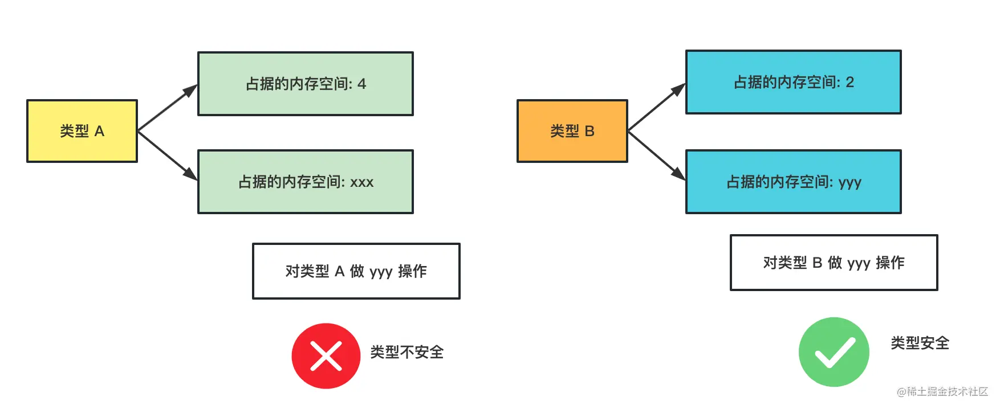
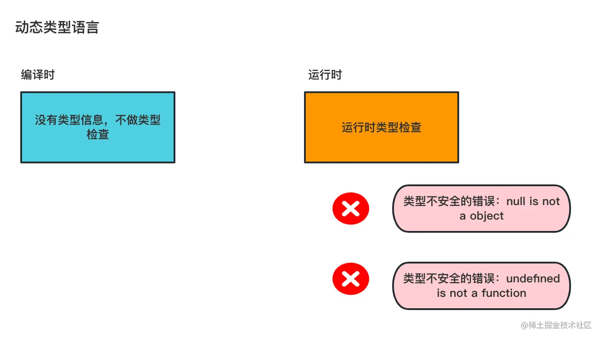
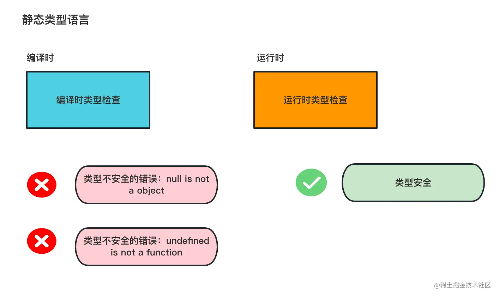

### 
# 2 为什么说 TypeScript 的火爆是必然？
TypeScript 这些年越来越火，可以说是前端工程师的必备技能了，各大框架都基于它实现。

那么，TypeScript 的出现和爆火是偶然发生的吗？其实不是，类似 TypeScript 这种静态类型语言成为主流是必然会发生的。为什么这么说呢？

**让我们先思考一个问题：类型是什么？**

类型具体点来说就是指 number、boolean、string 等基础类型和 Object、Function 等复合类型，它们是编程语言提供的对不同内容的抽象：

* **不同类型变量占据的内存大小不同**：boolean 类型的变量会分配 4 个字节的内存，而 number 类型的变量则会分配 8 个字节的内存，给变量声明了不同的类型就代表了会占据不同的内存空间。
* **不同类型变量可做的操作不同**：number 类型可以做加减乘除等运算，boolean 就不可以，复合类型中不同类型的对象可用的方法不同，比如 Date 和 RegExp，变量的类型不同代表可以对该变量做的操作就不同。

我们知道了什么是类型，那自然可以想到类型和所做的操作要匹配才行，这就是为什么要做类型检查。

\*\*如果能保证对某种类型只做该类型允许的操作，这就叫做`类型安全`\*\*。比如你对 boolean 做加减乘除，这就是类型不安全，你对 Date 对象调用 exec 方法，这就是类型不安全。反之，就是类型安全。

所以，**类型检查是为了保证类型安全的**。

类型检查可以在运行时做，也可以运行之前的编译期做。这是两种不同的类型，前者叫做动态类型检查，后者叫做静态类型检查。

两种类型检查各有优缺点。`动态类型检查` 在源码中不保留类型信息，对某个变量赋什么值、做什么操作都是允许的，写代码很灵活。但这也埋下了类型不安全的隐患，比如对 string 做了乘除，对 Date 对象调用了 exec 方法，这些都是运行时才能检查出来的错误。

其中，最常见的错误应该是 “null is not an object”、“undefined is not a function” 之类的了，写代码时没发现类型不匹配，到了运行的时候才发现，就会有很多这种报错。

所以，动态类型虽然代码写起来简单，但代码中很容易藏着一些类型不匹配的隐患。

`静态类型检查`则是在源码中保留类型信息，声明变量要指定类型，对变量做的操作要和类型匹配，会有专门的编译器在编译期间做检查。

静态类型给写代码增加了一些难度，因为你除了要考虑代码要表达的逻辑之外，还要考虑类型逻辑：变量是什么类型的、是不是匹配、要不要做类型转换等。

不过，静态类型也消除了类型不安全的隐患，因为在编译期间就做了类型检查，就不会出现对 string 做了乘除，调用了 Date 的 exec 方法这类问题。

所以，静态类型虽然代码写起来要考虑的问题多一些，会复杂一些，但是却消除了代码中潜藏类型不安全问题的可能。

知道了动态类型检查和静态类型检查的区别，我们自然可以得出这样的结论：

**动态类型只适合简单的场景，对于大项目却不太合适，因为代码中可能藏着的隐患太多了，万一线上报一个类型不匹配的错误，那可能就是大问题。**

**而静态类型虽然会增加写代码的成本，但是却能更好的保证代码的健壮性，减少 Bug 率。**

所以，**大型项目注定会用静态类型语言开发。**

JavaScript 本来是为了浏览器的表单验证而设计的，所以就设计成了动态类型的，写代码比较简单。

但 JavaScript 也没想到它后来会被用来开发各种项目，比如 PC 和移动端的网页、React Native 跨端 App、小程序、Electron 桌面端、Node.js 服务端、Node.js 工具链等。

开发各种大型项目的时候，JavaScript 的动态类型语言的缺点就暴露出来了，bug 率太高了，健壮性很难保证。那自然就有了对静态类型的强烈需求，于是 TypeScript 应运而生。

TypeScript 给 JavaScript 添加了一套静态类型系统，从动态类型语言变成了静态类型语言，可以在编译期间做类型检查，提前发现一些类型安全问题。

而且，因为代码中添加了静态类型，也就可以配合编辑器来实现更好的提示、重构等，这是额外的好处。

所以，TypeScript 的火爆是一个偶然么？不，我觉得是必然，因为大型项目注定会用静态类型语言来开发。

## 总结
类型决定了变量的内存大小和可以对它进行的操作，保证对什么类型只做什么操作就叫做类型安全，而保证类型安全的方式就是类型检查。

类型检查可以在运行时做，叫做动态类型检查，也可以在编译时做，叫做静态类型检查。

动态类型可能藏在代码里的隐患太多了，bug 率比较高，所以大型项目注定会用静态类型语言来开发。

JavaScript 本身是一门动态类型语言，因为被越来越多的用来开发各种大型项目，所以就有了对静态类型的需求。TypeScript 就满足了这个需求。而且还有额外的更好的提示、更易于重构的好处。

所以，TypeScript 的出现和现在的火爆是必然会发生的。
