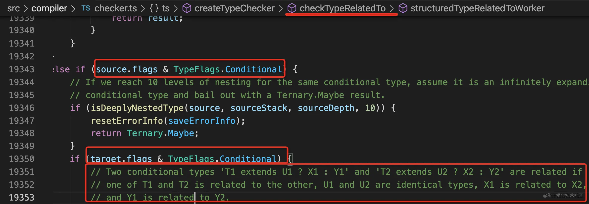
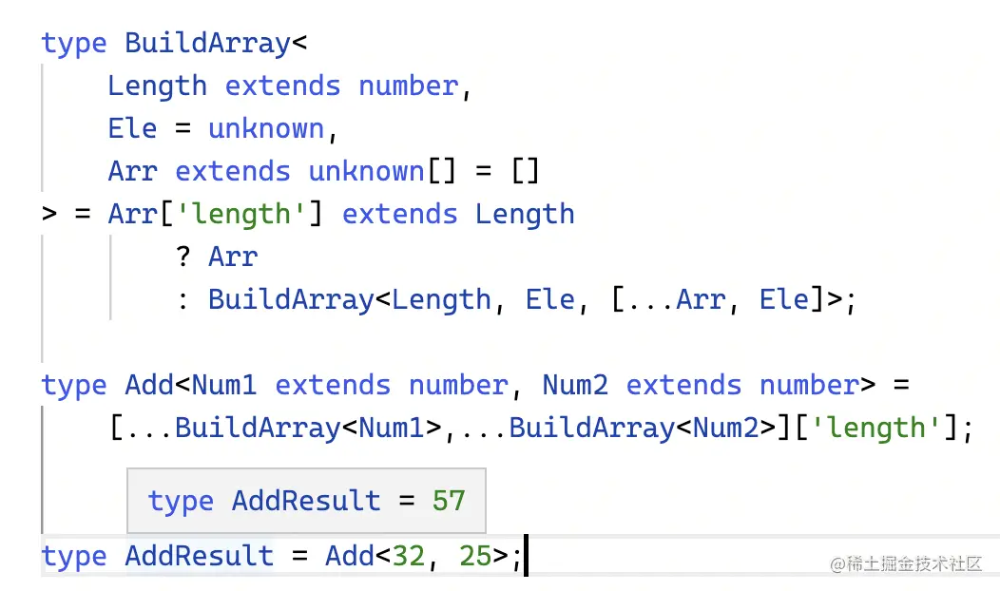
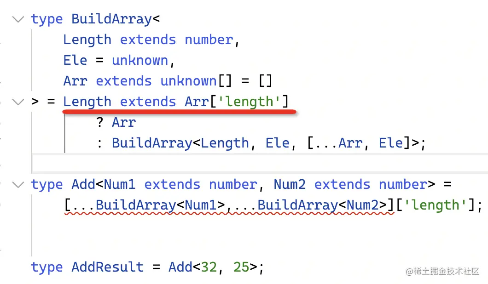
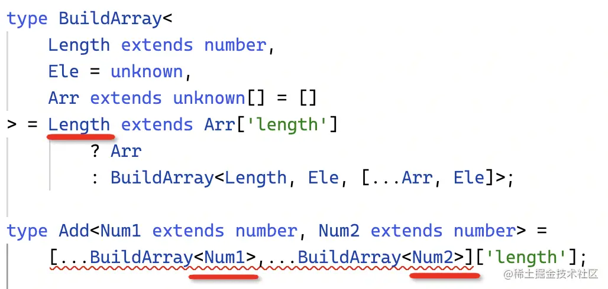
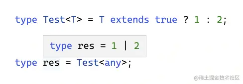
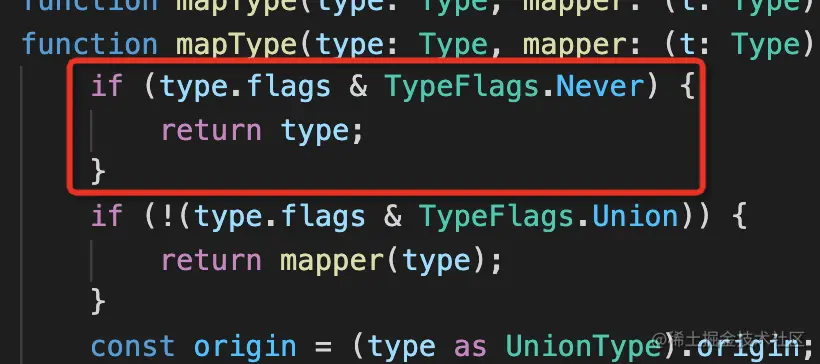

### 
# 21 原理篇：一些特殊情况的说明
学完了各种套路，做了大量练习之后，各种类型编程逻辑我们都能写了。但是依然会遇到一些难以解释的、令人困惑的点。

这一节就来集中讲一下这些令人困惑的地方的原理。

## isEqual 为什么要这样写
前面讲过 isEqual 要这样写：

```Plain Text
type IsEqual<A, B> = (<T>() => T extends A ? 1 : 2) extends (<T>() => T extends B ? 1 : 2)
    ? true : false;

```
这样才能正确的判断 any：


[试一下](https://link.juejin.cn/?target=https%3A%2F%2Fwww.typescriptlang.org%2Fplay%3Fts%3D4.5.0-beta%23code%2FC4TwDgpgBAkgzgUQI4FcCGAbAPAQQDRQBCAfFALxQAUWAKsZQJTmk1QQAewEAdgCZxQcUAPxQAjFABcUAExMOXPgOp1GzKKwU9%2BREeKmyGAKCim9wAE4po0gGaY4EANxHXoSLESpMAJQgCKeGR0bEtrAjRuEGInIA "https://www.typescriptlang.org/play?ts=4.5.0-beta#code/C4TwDgpgBAkgzgUQI4FcCGAbAPAQQDRQBCAfFALxQAUWAKsZQJTmk1QQAewEAdgCZxQcUAPxQAjFABcUAExMOXPgOp1GzKKwU9+REeKmyGAKCim9wAE4po0gGaY4EANxHXoSLESpMAJQgCKeGR0bEtrAjRuEGInIA")

这是为什么呢？

其实就是源码里的特殊处理。

xx extends yy 这里的判断逻辑在 checkTypeRelatedTo 这个函数里，里面定义了各种类型之间如何判断相关性。

其中就有两个都是条件类型的情况的处理：



如图，source 和 target 都是条件类型（Conditional Type）的时候会走到这里，然后有这样一段注释：

如果是两个条件类型 `T1 extends U1 ? X1 : Y1` 和 `T2 extends U2 ? X2 : Y2` 相关的话，那 T1 和 T2 相关、X1 和 X2 相关、Y1 和 Y2 相关，而 U1 和 U2 相等。

注意，这里 U1 和 U2 是相等的，不是相关。

如果是判断相关性的话，任意类型 extends any 都是 true，但通过构造两个条件类型判断相关性，就可以利用 extends 右边部分相等的性质来判断两个类型是否 equal。

比如 any 和 1，判断相关性的话，肯定是 true，但是判断相等的话，就是 false 了。不过 TS 没有暴露判断相等的方式，只有 extends 这个来判断类型相关性的语法。

这就是为什么我们要这样判断两个类型相等，就是利用了**两个条件类型判断相关性的时候会判断右边部分是否相等**的这个性质，算是一种 hack 的写法。答案要从源码找。

## 为什么我调整了下 extends 左右类型的位置，就报错了
前面我们实现过加法，是这样写的：



通过递归构造长度为 Num1 和 Num2 的元组，然后合并成一个新的元组再取长度的方式来实现的。

[试一下](https://link.juejin.cn/?target=https%3A%2F%2Fwww.typescriptlang.org%2Fplay%3F%23code%2FC4TwDgpgBAQgrgSwDYBMCCAnDBDEAeAKCmKgBkIA7Ac2AAsoIAPYSlAZygrgFsAjCDABooREgFEk0ALxQ4FANYUA9gHcKw0cUwYGzVhzmLVFANoBdKDPMEAfJajaTAcknU6Ti0xYV2ZSjXpNEmIAfgcsEWDggC5YRFRtXDxyN1phCQhhEwA6XO10yTMbAG4CAlBIBxQUPAA5HgBGXW9fLj4BYXruACZm-U4efgw7GSCc3PhkdCwkroabQVzsyYSZ-C7umzNnVwCPUrKK6DRqgCUINjgkYHsTmoBmbuFugFYSoA "https://www.typescriptlang.org/play?#code/C4TwDgpgBAQgrgSwDYBMCCAnDBDEAeAKCmKgBkIA7Ac2AAsoIAPYSlAZygrgFsAjCDABooREgFEk0ALxQ4FANYUA9gHcKw0cUwYGzVhzmLVFANoBdKDPMEAfJajaTAcknU6Ti0xYV2ZSjXpNEmIAfgcsEWDggC5YRFRtXDxyN1phCQhhEwA6XO10yTMbAG4CAlBIBxQUPAA5HgBGXW9fLj4BYXruACZm-U4efgw7GSCc3PhkdCwkroabQVzsyYSZ-C7umzNnVwCPUrKK6DRqgCUINjgkYHsTmoBmbuFugFYSoA")

有的同学发现把 Length 和 Arr\['length'\] 对调之后就报错了：



报的错误是无限递归了：


[试一下](https://link.juejin.cn/?target=https%3A%2F%2Fwww.typescriptlang.org%2Fplay%3F%23code%2FC4TwDgpgBAQgrgSwDYBMCCAnDBDEAeAKCmKgBkIA7Ac2AAsoIAPYSlAZygrgFsAjCDABooREgFEk0ALxQ4FANYUA9gHcKw0cUwYGzVhzmLVFANoBdKDPMEAfJbKUa9Jiwrso2kwHJJ1Ol7NNEmIAfg8sEWDggC5YRFRtXDxyP1phCQhhEwA6XO10yTMbAG4CAlBIDxQUPAA5HgBGXVd3Lj4BYXruACZm-U4efgw7GSCc3PhkdCwkroabQVzsyYSZ-C7umzNvXycA0rKK6DRqgCUINjgkYHsTmoBmbuFugFYSoA "https://www.typescriptlang.org/play?#code/C4TwDgpgBAQgrgSwDYBMCCAnDBDEAeAKCmKgBkIA7Ac2AAsoIAPYSlAZygrgFsAjCDABooREgFEk0ALxQ4FANYUA9gHcKw0cUwYGzVhzmLVFANoBdKDPMEAfJbKUa9Jiwrso2kwHJJ1Ol7NNEmIAfg8sEWDggC5YRFRtXDxyP1phCQhhEwA6XO10yTMbAG4CAlBIDxQUPAA5HgBGXVd3Lj4BYXruACZm-U4efgw7GSCc3PhkdCwkroabQVzsyYSZ-C7umzNvXycA0rKK6DRqgCUINjgkYHsTmoBmbuFugFYSoA")

这是为什么呢，逻辑看起来没啥错误呀？

大家可以先看下这个案例：


声明一个泛型函数，取它的参数类型，结果是 unknown。

有的同学说，这很正常啊，高级类型就像函数调用一样，现在还没调用，没传入参数呢，当然是 unknown。

对，**类型编程中如果需要取类型参数做一些计算的时候，默认推导出的是约束的类型，如果没有类型约束，那就是 unknown**。

上面那个类型把 T 约束为 number，推导出的就是 number：


Add 那个类型把约束写死为具体的数字的时候，就会发现不报错了：


[试一下](https://link.juejin.cn/?target=https%3A%2F%2Fwww.typescriptlang.org%2Fplay%3F%23code%2FC4TwDgpgBAQgrgSwDYBMCCAnDBDEAeAKCmKgBkIA7Ac2AAsoIAPYSlAZygrgFsAjCDABooREgFEk0ALxQ4FANYUA9gHcKw0cUwYGzVhzmLVFANoBdKDPMEAfJbKUa9Jiwrso2kwHJJ1Ol7NNEmIAfg8sEWDggC5YRFRtXDxyP1phCQhhEwA6XO10yTMbAG4CAlBIDxQUPAA5HgBGXVd3AGYAJmF67nbm-Sh2gFY7GSCc3PhkdCwk7oabQVzsyYSZ-G72mzNvXycA0vLwaDRqgCUINjgkYHsTmo7hIZKCIA "https://www.typescriptlang.org/play?#code/C4TwDgpgBAQgrgSwDYBMCCAnDBDEAeAKCmKgBkIA7Ac2AAsoIAPYSlAZygrgFsAjCDABooREgFEk0ALxQ4FANYUA9gHcKw0cUwYGzVhzmLVFANoBdKDPMEAfJbKUa9Jiwrso2kwHJJ1Ol7NNEmIAfg8sEWDggC5YRFRtXDxyP1phCQhhEwA6XO10yTMbAG4CAlBIDxQUPAA5HgBGXVd3AGYAJmF67nbm-Sh2gFY7GSCc3PhkdCwk7oabQVzsyYSZ-G72mzNvXycA0vLwaDRqgCUINjgkYHsTmo7hIZKCIA")

所以上面 Add 那个类型里取 Num1 和 Num2 传入 BuildArray 做计算的话，其实传入的是 number：



number extends 某个具体的数字自然永远不成立，永远是 false，所以就无限递归了。反过来写就不会有这个问题。

## 几个条件类型的特殊情况
有这样几个条件类型，大家先试着猜下 res 都是啥：

第一个：

传入的类型参数为联合类型 1 | 'a'，问 res 是啥

```Plain Text
type Test<T> = T extends number ? 1 : 2;

type res = Test<1 | 'a'>;

```
第二个：

传入的类型参数为 boolean，问 res 是啥

```Plain Text
type Test<T> = T extends true ? 1 : 2;

type res = Test<boolean>;

```
第三个：

传入的类型参数为 any，问 res 是啥

```Plain Text
type Test<T> = T extends true ? 1 : 2;

type res = Test<any>;

```
第四个：

传入的类型参数为 never，问 res 是啥

```Plain Text
type Test<T> = T extends true ? 1 : 2;

type res = Test<never>;

```
先记一下自己的答案，接下来我公布正确答案，大家看下猜对了几个。

### 答案
第一个类型 res 是 1 | 2


再来看第二个类型，res 也是 1 | 2


接下来是第三个类型，res 也是 1 | 2



最后是第四个类型，res 是 never


不管答对了几个都没关系，关键是要知道它的原因，接下来我解释下：

### 原因
第一个就是分布式条件类型的特性，联合类型作为类型参数出现在条件类型左边的时候，会把每个类型单独传入做计算，把结果合并成联合类型。这个我们上节还看过源码。

第二个是因为 boolean 也是联合类型，是 true | false，所以也会触发分布式条件类型。这个可以从源码的注释中找到说明，感兴趣也可以调试下源码，判断下 flags。


第三个是条件类型中 any 的特殊处理，如果左边是 any，则会返回 trueType 和 falseType 的联合类型：


第四个其实严格来说也是分布式条件类型的一种情况，ts 处理分布式条件类型的时候对 Union 和 Never 都做了特殊处理：


但是后面走的分支不一样：




可以看到，如果是 never，那就直接返回了。

所以当条件类型左边是 never 的时候，就会直接返回 never。

严格来说分布式条件类型是包含 Union 和 Never 两种情况的，只不过 never 的情况比较特殊，可以单独摘出来讲，平时我们谈到分布式条件类型（distributive conditional type）就是指联合类型 Union 的情况。

## 总结
这一节我们集中讲了一些 ts 里令人困惑的点：

* 判断相等是根据“两个条件类型如果相关，那么 extendsType 部分是相等的”这个特性。
* 类型参数默认推导出的是类型约束的类型。
* 条件类型中，联合类型、any、never、boolean 都比较特殊：
* 联合类型有分布式条件类型的特性，会分发传入
* boolean 也是联合类型
* any 会直接返回 trueType 和 falseType 的联合类型
* never 会直接返回 never，严格来说这个也是分布式条件类型的一种情况

这节从源码角度理清了一些情况的原理，如果大家还有一些困惑的点的话可以告诉我，我再补充进来。
