### 
# 25 加餐：一道 3 层的 ts 面试题
最近遇见一道不错的 TS 面试题，分享一下。

这道题有 3 个层次，我们一层层来看。

第一层的要求是这样的：

**实现一个 zip 函数，对两个数组的元素按顺序两两合并，比如输入 \[1,2,3\], \[4,5,6\] 时，返回 \[\[1,4\], \[2,5\],\[3,6\]\]**

这层就是每次各从两个数组取一个元素，合并之后放到数组里，然后继续处理下一个，递归进行这个流程，直到数组为空即可。

```Plain Text
function zip(target, source) {
  if (!target.length || !source.length) return [];

  const [one, ...rest1] = target;
  const [other, ...rest2] = source;

  return [[one, other], ...zip(rest1, rest2)];
}

```
结果是对的：

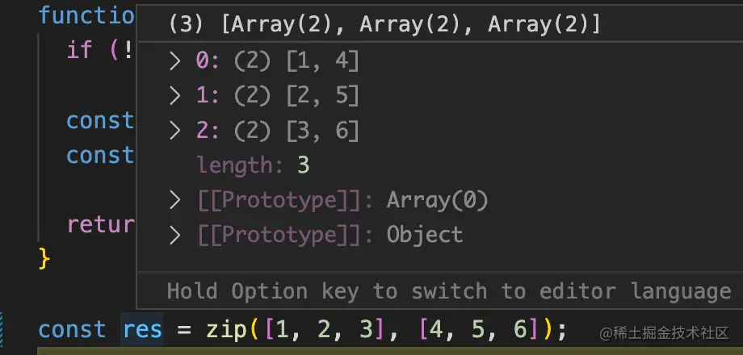

第一层还是比较简单的，然后我们来看第二层要求：

**给这个 zip 函数定义 ts 类型（两种写法）**

函数的定义有两种形式：

直接通过 function 声明函数：

```Plain Text
function func() {}

```
和声明匿名函数然后赋值给变量：

```Plain Text
const func = () => {}

```
而参数和返回值的类型都是数组，只是具体类型不知道，可以写 unknown\[\]。

所以两种函数类型的定义就是这样的：


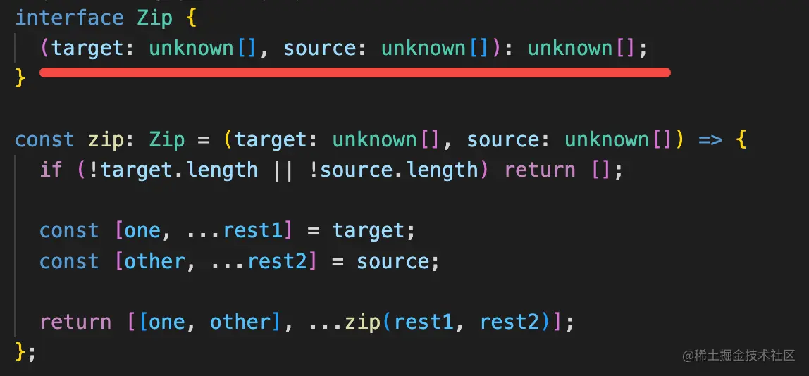

也是直接 function 声明函数类型和 interface 声明函数类型然后加到变量类型上两种。

因为具体元素类型不知道，所以用 unknown。

这里可能会问 any 和 unknown 的区别：

any 和 unknown 都可以接收任何类型：

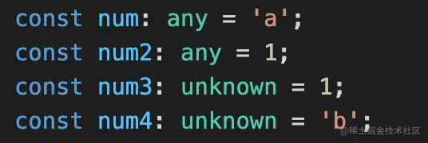

但是 any 也可以赋值给任何类型，但 unknown 不行。


这里只是用来接收其他类型， 所以 unknown 比any 更合适一些，更安全。

这一层也是比较基础的 ts 语法，第三层就上了难度了：

**用类型编程实现精确的类型提示，比如参数传入 \[1,2,3\], \[4,5,6\]，那返回值的类型要提示出 \[\[1,4\], \[2,5\],\[3,6\]\]**

这里要求返回值类型是精确的，我们就要根据参数的类型来动态生成返回值类型。

也就是这样：

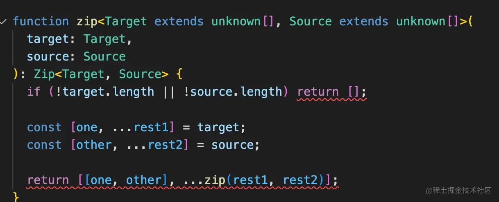

声明两个类型参数 Target、Source，约束为 unknown\[\]，也就是元素类型任意的数组类型。

这俩类型参数分别是传入的两个参数的类型。

返回值通过 Zip 计算得出。

然后要实现 Zip 的高级类型：

传入的类型参数分别是两个数组类型，我们同样要从中提取出每个元素合并到一起。

提取元素可以用模式匹配的方式：


所以这个类型就可以这样定义：

```Plain Text
type Zip<One extends unknown[], Other extends unknown[]> =
    One extends [infer OneFirst,...infer Rest1]
      ? Other extends [infer OtherFirst, ...infer Rest2]
        ? [[OneFirst, OtherFirst], ...Zip<Rest1, Rest2>]
        : []
      : [];

```
分别提取两个数组的第一个元素，构造成新数组。然后对剩下的数组递归进行这样的处理，直到数组为空。

这样就实现了我们想要的高级类型：


但你把它作为返回值加到函数上会报错：

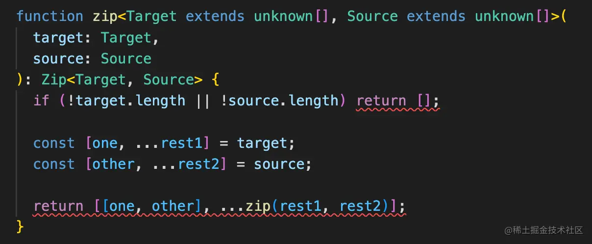

因为声明函数的时候都不知道参数是啥，自然计算不出 Zip<Target, Source> 的值，所以这里会类型不匹配：

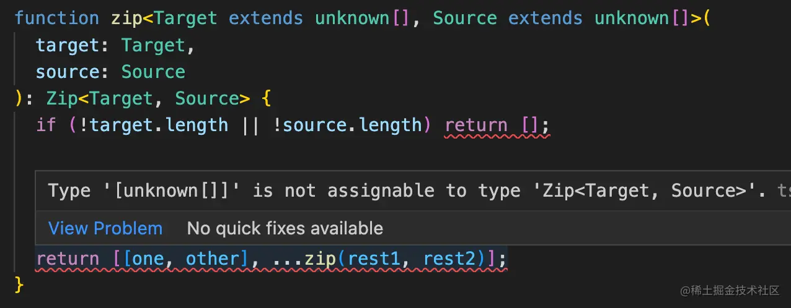

那怎么办呢？

可以用函数重载解决：

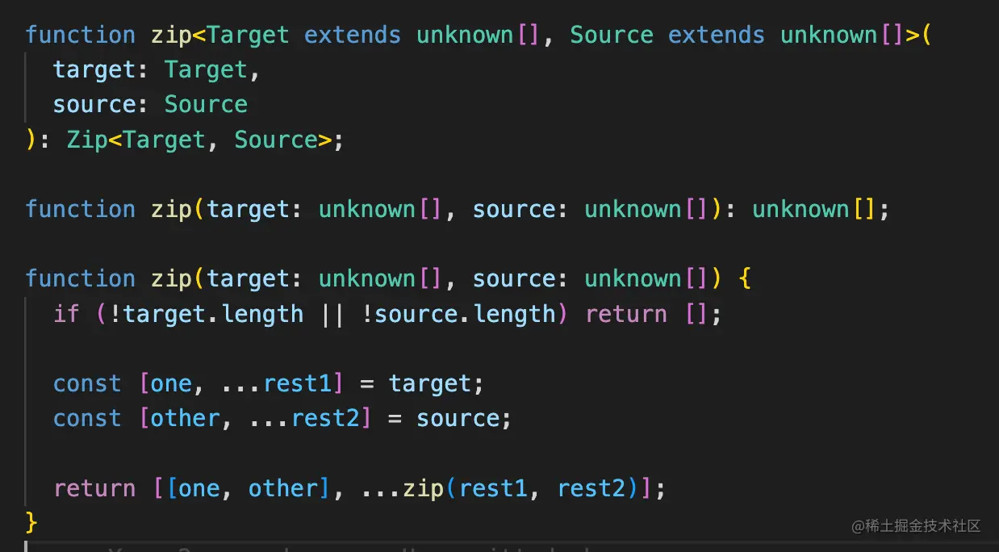

ts 支持函数重载，可以写多个同名函数的类型的类型定义，最后写函数的实现，这样用到这个函数的时候会根据参数的类型来匹配函数类型。

我们用了类型编程的那个函数通过这种方式写就不会报错了。

我们使用下看看：


咋返回值的类型不对呢？


其实这时候匹配的函数类型是对的，只不过推导出的不是字面量类型。

这时候可以加个 as const。


但是加上 as const 会推导出 readonly \[1,2,3\]


这样类型就不匹配了，所以要在类型参数的声明上也加上 readonly:

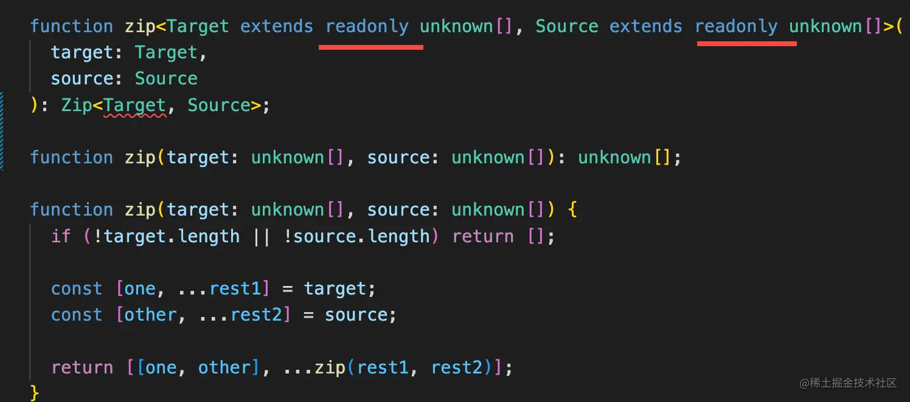

但这样 Zip 函数的类型又不匹配了。

难道要把所有用到这个类型的地方都加上 readonly 么？

不用，我们 readonly 的修饰去掉不就行了？

Typescript 有内置的高级类型 readonly：


可以把索引类型的每个索引都加上 readonly 修饰：

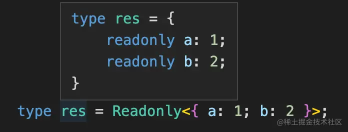

但没有提供去掉 readonly 修饰的高级类型，我们可以自己实现一下：


用映射类型的语法构造个新索引类型，加上个 -readonly 就是去掉 readonly 修饰的意思。


有的同学可能问了，数组类型也是索引类型么？

是，索引类型是聚合多个元素的类型，所以对象、数组、class 都是。

所以我们把它用在数组上自然也是可以的：


（准确来说叫元组，元组是元素个数固定的数组）

那我们只要在传入 Zip 之前，用 Mutable 去掉 readonly 就可以了：

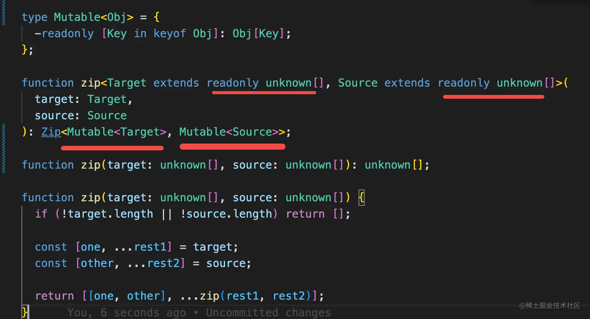

再来试一下：


大功告成！现在返回值的类型就对了。

但还有个问题，如果不是直接传入字面量，是推导不出字面量类型的，这时候貌似就不对了：

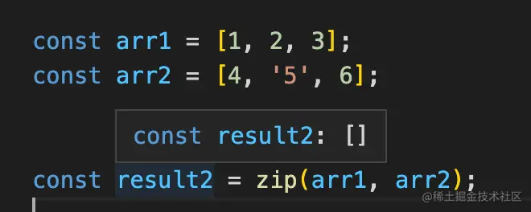

可我们不都声明重载类型了么？

如果推导不出字面量类型，应该匹配这个呀：


但实际上它匹配的还是第一个：


这时候其实只要调换下两个函数类型的顺序就可以了：


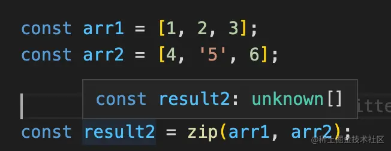

这时字面量参数的情况依然也是对的：


为什么呢？

因为**重载函数的类型是从上到下依次匹配，只要匹配到一个就应用。**

非字面量的情况，类型是 number\[\]，能匹配 unknown\[\] 的那个类型，所以那个函数类型生效了。


而字面量的情况，推导出的是 readonly \[1,2,3\]，带有 readonly 所以不匹配 unknown\[\]，继续往下匹配，就匹配到了带有类型参数的那个函数类型。

这样两种情况就都应用了合适的函数类型。

全部代码是这样的：

```Plain Text
type Zip<One extends unknown[], Other extends unknown[]> = One extends [
  infer OneFirst,
  ...infer Rest1
]
  ? Other extends [infer OtherFirst, ...infer Rest2]
    ? [[OneFirst, OtherFirst], ...Zip<Rest1, Rest2>]
    : []
  : [];

type Mutable<Obj> = {
  -readonly [Key in keyof Obj]: Obj[Key];
};

function zip(target: unknown[], source: unknown[]): unknown[];

function zip<Target extends readonly unknown[], Source extends readonly unknown[]>(
  target: Target,
  source: Source
): Zip<Mutable<Target>, Mutable<Source>>;

function zip(target: unknown[], source: unknown[]) {
  if (!target.length || !source.length) return [];

  const [one, ...rest1] = target;
  const [other, ...rest2] = source;

  return [[one, other], ...zip(rest1, rest2)];
}

const result = zip([1, 2, 3] as const, [4, 5, 6] as const);

const arr1 = [1, 2, 3];
const arr2 = [4, '5', 6];

const result2 = zip(arr1, arr2);


```
[ts playground 地址](https://link.juejin.cn/?target=https%3A%2F%2Fwww.typescriptlang.org%2Fplay%3F%23code%2FC4TwDgpgBAWglmAPAeQHbQgD2BVATAZygFdUBrVAewHdUBtAXQBoplgALCAJyix3yKkKNegwB8UALxQAUFFbpe2XISh04qAGbcFEAGJwuBYCwB05jdp4AlCMYCMDOfKgB%2BVhx18VRdVp1snFwGRiZQ5qaWOrbGAExOLi7udHRo%2BobGLIHcIcbM4ebwSDHA9iwlsWIJiVAAXGrV8vWMANwyMqCQUACyxMAAhgBGADYQKIMAVhLSAN7OALRcEP14lKjDIGoA0hCbGlBku5SarJMM9ciTdDsgDG0Avm0ymqQAxsBwa1AAXggAFAMuABzCDAepCKi0RgsAiUYhcV4QcHkSGiACUyOEULu7ReqHen1QPwQiAAKv1gaClPxVEsVmsNiQUSJoVAAMpwhEYZQCKB01brTYQlniP7OQEgsFQcmUkzOWHwxH1DmKiAyDGwEm9AYjMYyyViFjaoajRAqrliMRPPEEr6-MAAimSzGo1kKrkukVoqBzeRwE5-ACEEtBplGqCBHCgAB9o1BA%2B7EWHcJH2N6lsB4UTWu15K81sY1GsIGZzEsHAwpFAQ8A2nmC8Ai54uKXTOXgPEq4mIE95Bms2o6MWWJRm-kIva-u2yny7B20Tj7u186hC%2BXiMNG9JJ3QZ7EWABmSv9IgrzJqAAsLAArCwAGzH08NtFPM%2BNilcexV3csfdQI9tG%2BUAfrE35XlAADk14QfeOIyEB66bqB27-B%2BM4gS%2BQA "https://www.typescriptlang.org/play?#code/C4TwDgpgBAWglmAPAeQHbQgD2BVATAZygFdUBrVAewHdUBtAXQBoplgALCAJyix3yKkKNegwB8UALxQAUFFbpe2XISh04qAGbcFEAGJwuBYCwB05jdp4AlCMYCMDOfKgB+Vhx18VRdVp1snFwGRiZQ5qaWOrbGAExOLi7udHRo+obGLIHcIcbM4ebwSDHA9iwlsWIJiVAAXGrV8vWMANwyMqCQUACyxMAAhgBGADYQKIMAVhLSAN7OALRcEP14lKjDIGoA0hCbGlBku5SarJMM9ciTdDsgDG0Avm0ymqQAxsBwa1AAXggAFAMuABzCDAepCKi0RgsAiUYhcV4QcHkSGiACUyOEULu7ReqHen1QPwQiAAKv1gaClPxVEsVmsNiQUSJoVAAMpwhEYZQCKB01brTYQlniP7OQEgsFQcmUkzOWHwxH1DmKiAyDGwEm9AYjMYyyViFjaoajRAqrliMRPPEEr6-MAAimSzGo1kKrkukVoqBzeRwE5-ACEEtBplGqCBHCgAB9o1BA+7EWHcJH2N6lsB4UTWu15K81sY1GsIGZzEsHAwpFAQ8A2nmC8Ai54uKXTOXgPEq4mIE95Bms2o6MWWJRm-kIva-u2yny7B20Tj7u186hC+XiMNG9JJ3QZ7EWABmSv9IgrzJqAAsLAArCwAGzH08NtFPM+NilcexV3csfdQI9tG+UAfrE35XlAADk14QfeOIyEB66bqB27-B+M4gS+QA")

## 总结
今天我们做了一道综合的 ts 面试题，一共有三层：

第一层实现 js 的逻辑，用递归或者循环都能实现。

第二层给函数加上类型，用 function 声明类型和 interface 声明函数类型两种方式，参数和返回值都是 unknown\[\]。

第三层是用类型编程实现精准的类型提示，这一层需要拿到参数的类型，通过提取元素的类型并构造出新的数组类型返回。还要通过函数重载的方式来声明类型，并且要注意重载类型的声明顺序。

as const 能够让字面量推导出字面量类型，但会带有 readonly 修饰，可以自己写映射类型来去掉这个修饰。

其实这也是我们学习 ts 的顺序，我们先要能把 js 逻辑写出来，然后知道怎么给函数、class 等加 ts 类型，之后学习类型编程，知道怎么动态生成类型。

其中类型编程是 ts 最难的部分，也是最强大的部分。攻克了这一层，ts 就可以说学的差不多了。
